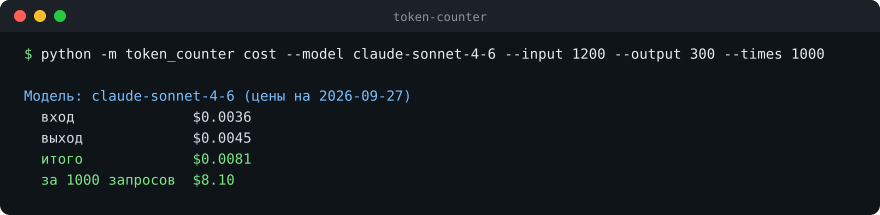

# token-counter

[](https://github.com/maarshir/token-counter/actions/workflows/tests.yml)



Токены ничего не говорят о деньгах, пока не умножишь их на цену модели. token-counter делает это за вас: считает стоимость запроса по токенам из ответа API или прикидывает её по тексту промпта ещё до отправки.

## Как запустить

```bash
pip install "token-counter @ git+https://github.com/maarshir/token-counter"
token-counter models                                       # цены с датой сверки и источником
token-counter cost --model claude-haiku-4-5 --input 5000 --output 800 --cache-read 20000
token-counter estimate --model claude-sonnet-4-6 --file prompt.txt --output 512 --times 100
```

Нужен Python 3.10+. Прикидка работает без сети и ключа, а с `--exact` берёт точное число токенов у Anthropic (нужен ключ). Из кода:

```python
from token_counter import Usage, cost, find_price, format_usd, load_prices

price = find_price("claude-sonnet-4-6", load_prices())
usage = Usage.from_api(response_json["usage"])        # Anthropic
# usage = Usage.from_openai(response_json["usage"])   # Groq и другие с интерфейсом OpenAI
print(format_usd(cost(usage, price).total))
```

В таблице четыре модели Anthropic и две открытые модели на Groq, цены сверены 27.09.2026. Свою таблицу можно подложить через `--prices`. При опечатке в имени модели программа подскажет похожее.

## Что было непросто

- **Деньги нельзя считать во float.** Десять тысяч одинаковых запросов во float давали 0.010500000000000956 вместо 0.0105. Цены хранятся строками и читаются в `Decimal`.
- **Мелкие суммы не должны становиться $0.00.** От доллара два знака, меньше доллара до шести, без лишних нулей.
- **Кэш промпта приходит в двух форматах.** У Anthropic он отдельными полями, у Groq уже внутри общего числа. Без отдельного разбора кэш посчитался бы дважды.

Подробнее о решениях: [docs/решения.md](docs/решения.md).

## Что дальше

- Предупреждение, если цены давно не сверялись.
- Больше моделей в таблице.

58 тестов, сеть в них подменена. Через token-counter [promptdiff](https://github.com/maarshir/promptdiff-) показывает цену каждого варианта промпта.
